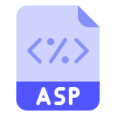

## 
 

*Net/Asp.net Developer with 2+ years of development experience*

In free time I'm interested:
- studying foreign languages;
- reading books (psychology, personal growth, business literature);
- studying programming languages;
- going a sports.

## Language and Tools

  <!--https://img.icons8.com/?size=100&id=55494&format=png&color=000000 (MD)-->

## Insight of Languages I use
<!---->

